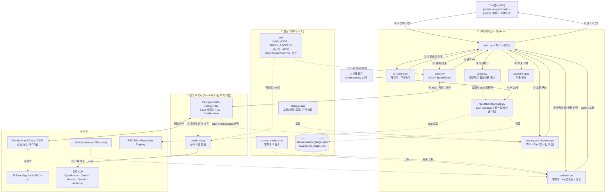
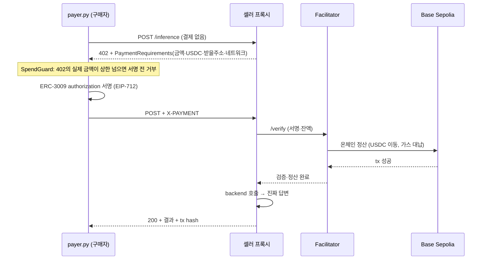

# 시스템 구조 (Architecture)

AI Purchasing Agent가 **무엇을 어디서 불러오고 어떤 순서로 작동하는지** 정리.

---

## 1. 한 줄 요약

자연어 요청 → 우선순위 추론 → **마켓에서 최적 오퍼(셀러×모델) 선택**(벤치마크+평판) → **x402 + ERC-3009**로 호출당 결제 → **진짜 모델 답변** → 배달체크 → **사람 👍/👎**가 다음 선택에 반영.

---

## 2. 전체 구성도

번호 ①~⑫ = 한 번의 호출 흐름. 점선 = 파일/설정 로드, 실선 = 런타임.



---

## 3. 컴포넌트

| 파일 | 역할 |
|------|------|
| `agent/nl_priority.py` | 자연어 프롬프트 → 우선순위 라벨(룰; LLM 스텁) |
| `agent/selector.py` | 오퍼를 벤치마크×우선순위로 스코어링 + 평판 factor |
| `agent/catalog.py` | **오퍼(셀러×모델)** 로드. 같은 모델을 셀러 여럿이 |
| `agent/discovery.py` | 마켓(`/marketplace`)서 오퍼 실시간 조회 |
| `agent/payer.py` | x402 클라이언트(mock+real) + SpendGuard(실제 금액) + PaymentError |
| `agent/judge.py` | 배달체크(빈값·거부·에러). 품질심판 아님 |
| `agent/accounting.py` | 지출 원장 + 요약 |
| `agent/main.py` | 오케스트레이터 |
| `seller_proxy/main.py` | mock x402 셀러 + `GET /marketplace` |
| `seller_proxy/real.py` | real x402 셀러(x402 v2 미들웨어 + facilitator) |
| `seller_proxy/backends.py` | 진짜 모델 호출(openrouter/gemini/heurist/openai/anthropic/mock) |
| `reputation/feedback.py` | ERC-8004 giveFeedback + `load_reputation`(사람 가중) |
| `scripts/rate.py` | 사람 👍/👎 → 평판(source=human) |

## 4. "뭘 어디서 불러오나"

1. 벤치마크 점수 → `selector`가 `scores_cache.json`(또는 `--live` AA API).
2. 오퍼(셀러·모델·가격·속도) → `catalog.py`(로컬 `catalog.yaml`) 또는 `discovery.py`(마켓 `/marketplace`).
3. 평판 → `data/reputation_ledger.json`을 `load_reputation`이 집계(사람 피드백 가중).
4. 모드·지갑·키·상한 → `.env`.

## 5. 다중 셀러 = 오퍼

카탈로그 = **오퍼 목록**. 오퍼 = *셀러 하나 × 모델 하나*. 같은 오픈모델을 여러 셀러가 다른 **가격·속도**로 팜. selector가 벤치마크(모델)+오퍼가격+오퍼속도+셀러평판 종합해 최적 **오퍼** 선택.

```
같은 Llama: gamma $0.0012/35tps · beta $0.0015/60tps · alpha $0.0020/90tps
cheap→gamma  fast→alpha  gamma 부정직(👎)→다음엔 beta
```

## 6. x402 결제 핸드셰이크 (⑥ 상세)



- 가스리스(구매자는 서명만, facilitator 가스 대납). Base Sepolia 라이브 검증됨(tx `0xabb329c2…`).

## 7. 모드 스위치 (같은 코드 mock↔real)

| 스위치 | mock | real |
|--------|------|------|
| `X402_MODE` | 402 흐름 진짜, 서명·tx만 가짜. 지갑 불필요 | 진짜 ERC-3009 + 온체인 정산. 지갑 필요 |
| `PROXY_BACKEND` | mock echo (키 불필요) | 비우면 오퍼별 backend(openrouter/gemini/…) → **진짜 답변** |
| `REPUTATION_MODE` | 로컬 원장 | 온체인 giveFeedback |

## 8. 왜 프록시가 셀러인가

2026 현재 테스트넷에 pay-per-token LLM을 x402로 파는 제3자 없음(Heurist x402=메인넷 툴). 그래서 우리가 x402 게이트(프록시)를 세우고 뒤에서 실제 모델을 `backend`로 호출. **x402 결제와 실제 모델 호출을 분리** → 아무 모델이나 x402로 팔 수 있음. 단 payer가 진짜 제3자 x402 402 파싱함은 검증됨(`scripts/probe_real_402.py`).

## 9. 검증 상태 (라이브)

- x402 온체인 결제 Base Sepolia 성공 · 진짜 답변 OpenRouter(Llama 등)+Gemini(2.5 Flash) · 평판 루프(사람 👎→다음 회피) · 테스트 33/33.
