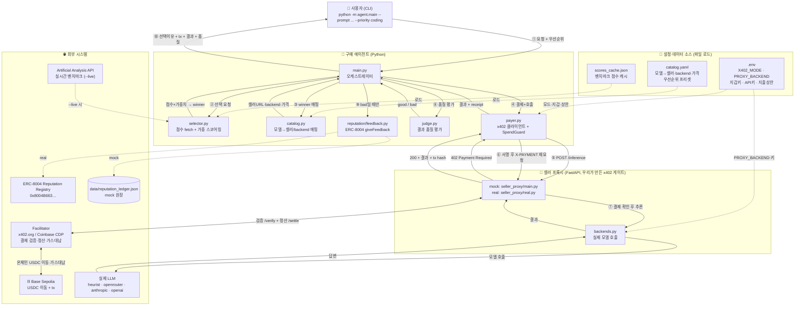
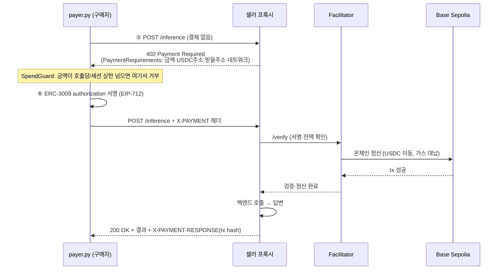

# 시스템 구조 (Architecture)

AI Purchasing Agent가 **무엇을 어디서 불러오고 어떤 순서로 작동하는지** 정리한 문서.

---

## 1. 한 줄 요약

사용자 요청 + 우선순위 → 벤치마크로 모델 선택 → **x402 + ERC-3009**로 호출당 결제 → 결과 → 품질 평가 → (나쁘면) ERC-8004 평판 기록.

---

## 2. 전체 구성도

번호 ①~⑩ = 한 번의 호출이 도는 순서. 점선 = 파일/설정 로드, 실선 = 런타임 흐름.



---

## 3. 컴포넌트 (파일별 역할)

| 파일 | 역할 |
|------|------|
| `agent/main.py` | **오케스트레이터** — 전체 흐름 지휘 |
| `agent/selector.py` | 벤치마크 점수 fetch + 우선순위 가중 정규화 스코어링 |
| `agent/catalog.py` | 모델 → 셀러/백엔드/가격 매핑, 우선순위 프리셋 |
| `agent/payer.py` | x402 결제 클라이언트 + `SpendGuard`(지출 상한) |
| `agent/judge.py` | 결과 품질 평가 (good/ok/bad) |
| `reputation/feedback.py` | ERC-8004 `giveFeedback` (mock 원장 / 온체인) |
| `seller_proxy/main.py` | **mock** x402 셀러 — 402 핸드셰이크 진짜, 암호화만 mock |
| `seller_proxy/real.py` | **real** x402 셀러 — x402 v2 라이브러리 + facilitator |
| `seller_proxy/backends.py` | 실제 모델 호출 (mock/heurist/openrouter/anthropic/openai) |
| `config/catalog.yaml` | 모델·셀러·backend·가격·우선순위 가중치 |
| `config/scores_cache.json` | 벤치마크 점수 캐시 (라이브 AA로 교체 가능) |

---

## 4. "뭘 어디서 불러오나" — 3개 로드 포인트

1. **벤치마크 점수** → `selector.py`가 `config/scores_cache.json`(기본) 또는 `--live`면 **Artificial Analysis API**(`/api/v2/language/models/free`, 헤더 `x-api-key`)에서 로드.
2. **모델 → 셀러/backend/가격** → `catalog.py`가 `config/catalog.yaml`에서 로드.
3. **모드·지갑·키·지출상한** → `.env`에서 `payer.py`(결제)와 `backends.py`(모델호출)가 각각 읽음.

---

## 5. 단계별 흐름

| # | 단계 | 하는 일 |
|---|------|---------|
| ① | 요청 | 사용자가 프롬프트 + 우선순위(예: `coding`) 입력 |
| ② | 선택 | `selector`가 점수를 우선순위 가중치로 스코어링 → winner |
| ③ | 매핑 | `catalog`가 winner → 셀러URL·backend·가격 조회 |
| ④~⑥ | 결제 | `payer`가 x402 핸드셰이크 (아래 6절 상세) |
| ⑦ | 추론 | 결제 확인 후 프록시가 `backend`로 실제 모델 호출 |
| ⑧ | 평가 | `judge`가 답변 품질 판정 |
| ⑨ | 평판 | 나쁘면 `reputation`이 ERC-8004에 기록 |
| ⑩ | 출력 | 선택 이유(점수표) + 결제 tx + 결과 + 품질 |

---

## 6. x402 결제 핸드셰이크 (⑤⑥ 상세)

가장 핵심. 결제 안 하면 402에서 막힌다.



- **가스리스**: 구매자는 서명만, 온체인 브로드캐스트·가스는 facilitator가 대납.
- **라이브 검증됨**: Base Sepolia에서 실제 성공 (예: tx `0xabb329c2…` — 구매자→판매자 USDC 이동).

---

## 7. 모드 스위치 (같은 코드, mock ↔ real)

환경변수로 가짜/진짜 전환. 개발은 전부 mock(지갑·키 0), 최종만 스왑.

| 스위치 | mock | real |
|--------|------|------|
| `X402_MODE` | `seller_proxy/main.py`. 402 흐름은 진짜, 서명·tx만 가짜. **지갑 불필요** | `seller_proxy/real.py`. 진짜 ERC-3009 서명 + Base Sepolia 온체인 정산. **펀딩 지갑 필요** |
| `PROXY_BACKEND` | 프롬프트 echo (키 불필요) | 안 정하면 모델별 `backend`로 라우팅 (각 키 필요) |
| `REPUTATION_MODE` | 로컬 JSON 원장 | 온체인 `giveFeedback` |

---

## 8. 왜 "프록시"가 셀러인가

```
[구매 에이전트] ──x402 결제──▶ [우리 프록시 셀러] ──일반 API──▶ [실제 모델]
                              (x402 게이트)          (Claude/GPT/오픈모델)
```

2026년 현재 **테스트넷에서 pay-per-token LLM을 x402로 파는 제3자가 없다** — 빅테크 모델은 x402 미지원, Heurist의 x402는 Base 메인넷 Mesh 툴 셀러(LLM 아님). 그래서 우리가 프록시로 x402 게이트를 세우고 그 뒤에서 실제 모델을 호출한다. x402 결제는 프록시에게, 모델은 `backend`가 수행.

단, payer가 **진짜 제3자 x402 402를 파싱함은 검증됨** — `python scripts/probe_real_402.py`(라이브 Heurist Mesh 402, 읽기 전용).

---

## 9. 검증 상태

- x402 결제: Base Sepolia **라이브 온체인 성공** (USDC 이동 + facilitator 가스 대납, basescan 확인)
- 선택 로직: 우선순위 바꾸면 다른 모델 (단위 테스트)
- 평판 루프: bad 판정 → 원장 기록 (단위 테스트)
- 테스트 17/17 통과
